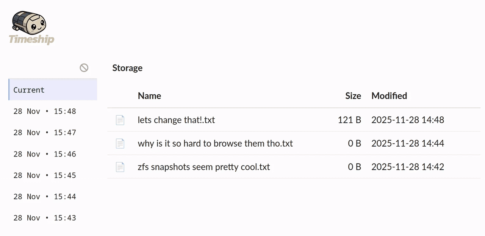

<!-- HEADER -->
<br />
<p align="center">
  <a href="https://github.com/smilyorg/photofield">
    
  </a>

  <h3 align="center">Timeship</h3>

  <p align="center">
    Your files. Any time.
    <br />
    <br />
  </p>
</p>


<!-- TABLE OF CONTENTS -->
<details open="open">
  <summary>Table of Contents</summary>
  <ol>
    <li>
      <a href="#about">About</a>
    </li>
    <li><a href="#features">Features</a></li>
    <li>
      <a href="#getting-started">Getting Started</a>
    </li>
    <li>
      <a href="#development">Development</a>
    </li>
    <li>
      <a href="#configuration">Configuration</a>
    </li>
    <li><a href="#built-with">Built With</a></li>
    <li><a href="#roadmap">Roadmap</a></li>
    <li><a href="#contributing">Contributing</a></li>
    <li><a href="#license">License</a></li>
  </ol>
</details>

## About



**Browse and restore files from filesystem snapshots.**

Timeship is a self-hosted web-based snapshot browser that allows you to explore and navigate through ZFS snapshots with an intuitive interface. It provides a seamless way to view historical versions of your files and directories across different points in time.

## Features

* **ZFS snapshot support**. Native support for ZFS snapshots with automatic timestamp parsing from common snapshot naming patterns.
* **File system navigation**. Browse files and directories within snapshots just like a regular file browser.
* **Single binary**. Self-contained Go binary with embedded UI, easy to deploy.
* **Read-only access**. Never modifies your snapshots or filesystem - completely safe to use.

## Getting Started

### Single-file Binary

You can run Timeship as a single binary, see below for Linux installation instructions (replace version as needed):

1. Download the latest release binary from the [Releases].
2. Unzip the binary: `unzip timeship_v0.0.2_linux_amd64.zip`
3. Install binary: `sudo cp timeship_v0.0.2_linux_amd64 /usr/local/bin/timeship`
4. Run `timeship` anywhere to see files and snapshots under the current directory:

```sh
timeship
```
```
 _______               __   _    
/_  __(_)_ _  ___ ___ / /  (_)__ 
 / / / /  ' \/ -_|_-</ _ \/ / _ \
/_/ /_/_/_/_/\__/___/_//_/_/ .__/
                   v0.0.2 /_/    

Root: /home/user/some/working/dir

Running (Press Ctrl+C to stop)
  local    http://127.0.0.1:8080
  network  http://172.17.0.1:8080
  network  http://172.18.0.1:8080
  network  http://192.168.1.7:8080
  local    http://[::1]:8080
  network  http://[fe80::64ab:72ff:fe39:5c2]:8080
  network  http://[fe80::6c4c:78ff:fe81:cef4]:8080
  network  http://[fe80::98d0:4462:fc9b:6271]:8080
```

[Releases]: https://github.com/SmilyOrg/timeship/releases

### Docker

You can also run Timeship using Docker:

```sh
docker run -p 8080:8080 -v /mnt/tank/your/dataset:/mnt/:ro ghcr.io/smilyorg/timeship
```
```sh
 _______               __   _    
/_  __(_)_ _  ___ ___ / /  (_)__ 
 / / / /  ' \/ -_|_-</ _ \/ / _ \
/_/ /_/_/_/_/\__/___/_//_/_/ .__/
                   v0.0.2 /_/    

Root: /mnt

Running (Press Ctrl+C to stop)
  local    http://127.0.0.1:8080
  network  http://172.16.0.5:8080
  local    http://[::1]:8080
  network  http://[fdd0::242:ac10:5]:8080
  network  http://[fe80::42:acff:fe10:5]:8080
```

Then open http://localhost:8080 in your browser.

**Note:** Make sure to mount your ZFS datasets or snapshot directories as volumes when running the container.

### Docker Compose

You can also use Docker Compose to run Timeship. Here is an example `compose.yml` file:

```yaml
services:
  timeship:
    image: ghcr.io/smilyorg/timeship:latest
    container_name: timeship
    ports:
      - 8080:8080
    volumes:
      - /mnt/ssd/docs:/mnt/docs:ro
      - /mnt/hdd/videos:/mnt/videos:ro
    restart: unless-stopped
```

Then open http://localhost:8080 in your browser.

**Note:** Make sure to mount your ZFS datasets or snapshot directories as volumes when running the container.

## Development

### Prerequisites

* [Go] 1.25+ - for building the API server
* [Node.js] - for building the frontend
* [Task] - for running build commands

### Running in Development Mode

Run the API server with auto-reload:
```sh
task api
```

Run the UI development server:
```sh
task ui
```

The UI dev server will run on http://localhost:5173 and proxy API requests to the API server on port 8080.

## Configuration

### Environment Variables

* `TIMESHIP_ROOT` - Root directory to serve (defaults to current working directory)

### ZFS Snapshot Patterns

Timeship automatically detects and parses common ZFS snapshot naming patterns:
- `auto-weekly-2025-11-09_00-00`
- `auto-hourly-2025-11-09_13-30`
- `backup-2025-11-09_14-30-45`
- `snapshot_20251109_143045`
- `daily-2025-11-09`

The patterns are not customizable yet.

## Built With

* [Go] - Backend API server
* [Vue 3] - Frontend framework
* [OpenAPI] - API specification and code generation
* [Task] - Build tool

## Roadmap

- [x] File restoration functionality
- [x] Pre-built binaries for releases
- [x] Docker container support
- [x] Text file preview
- [x] Docker container support
- [ ] Image file preview
- [ ] Configuration file support (YAML/JSON)
- [ ] Configurable snapshot name patterns via config file
- [ ] Authentication and authorization
- [ ] Mobile-responsive design
- [ ] Keyboard shortcuts
- [ ] Snapshot source: git commits
- [ ] Snapshot source: borg backups
- [ ] Diff view between snapshots
- [ ] Search within snapshots
- [ ] Timeline visualization
- [ ] File metadata display
- [ ] Snapshot comparison view
- [ ] Dark mode
- [ ] Caching layer for faster browsing
- [ ] Support for other snapshot systems (btrfs, LVM)

## Contributing

Pull requests are welcome. For major changes, please open an issue first to
discuss what you would like to change.

## License

Distributed under the MIT License. See `LICENSE` for more information.

[Go]: https://golang.org/
[Node.js]: https://nodejs.org/
[Vue 3]: https://v3.vuejs.org/
[Task]: https://taskfile.dev/
[OpenAPI]: https://www.openapis.org/
[Photofield]: https://github.com/SmilyOrg/photofield
[oapi-codegen]: https://github.com/oapi-codegen/oapi-codegen
